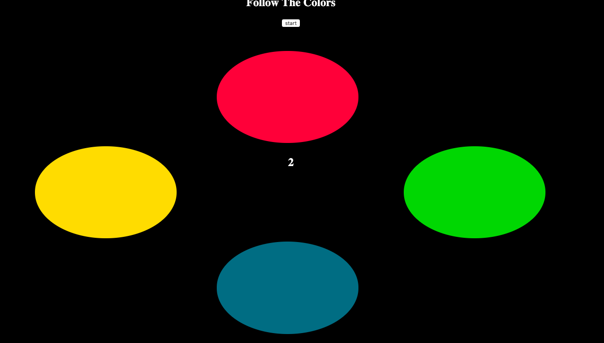

# simon2.0
### About
Simon is a pattern memorization game. Every round colors flash and you must remember and copy the pattern. After every round the pattern increases by one.

### Tech
*Javascript (Jquery), 
*Css
*Html

### Instructions 
Wait for the computer to flash out the pattern then try to copy it
https://goofy-brown-2b105a.netlify.com

### Futre
bug hunt
Sound!!!
Speed up on higher pattern
hard mode that adds a 5th button
